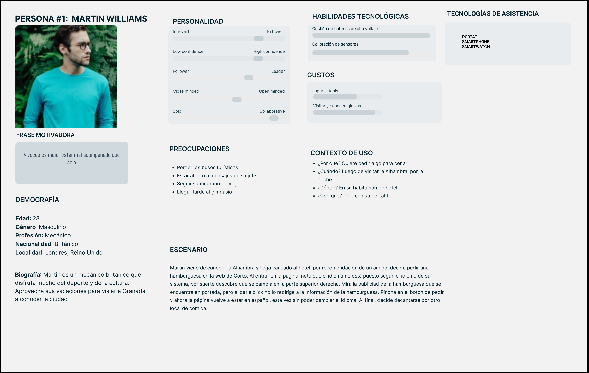
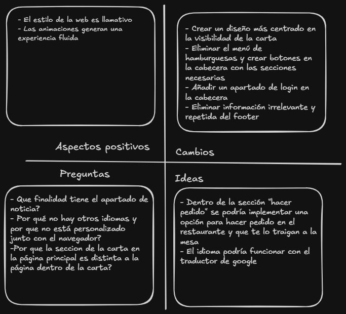
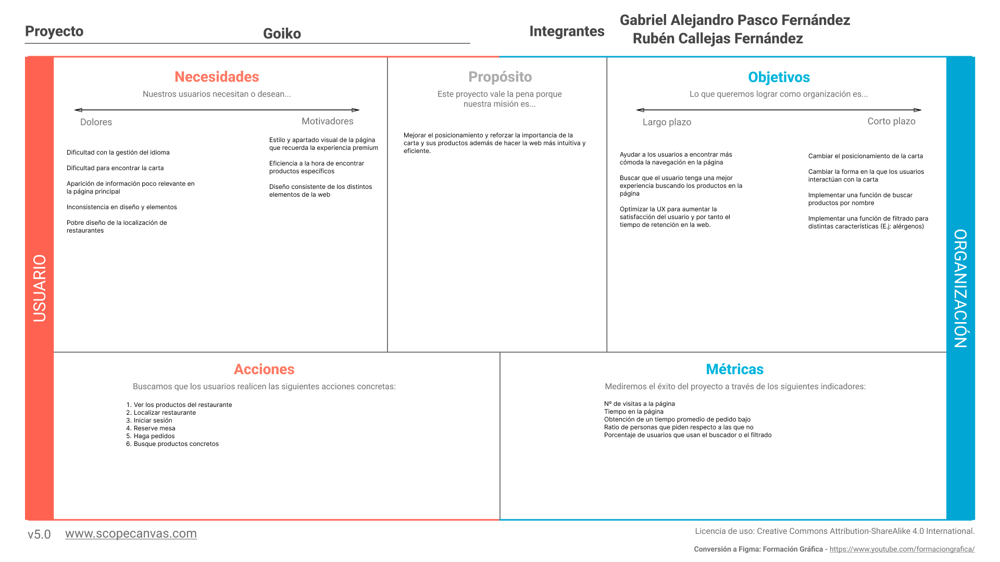
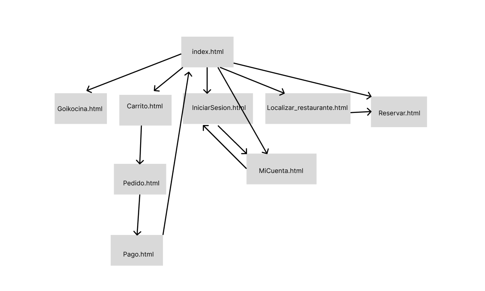

# DIU26
Prácticas Diseño Interfaces de Usuario (Tema: .... ) 

* [Guiones de prácticas](GuionesPracticas/)
* [Guía para crea tu Case Study](Guia_CaseStudy.md)
* Sala de la Fama [DIU Hall of fame](https://github.com/mgea/DIU/tree/master/hall_of_fame) donde se pueden encontrar Case Study destacados de otros años.

ENLACE A LA PÁGINA FUNCIONAL EN FIGMA: https://bundle-top-33186054.figma.site

## Paso 0 My UX-Case Study
 

###Grupo: DIU3_Los_Proyectados.  Curso: 2025/26 

Nombre del Proyecto: Goiko

Descripción: Se trata de un local centrado principalmente en las hamburguesas y orientado a la población joven, diferenciandose de otras cadenas y restaurantes por su estética y valores gourmet dentro de la comida rápida y callejera.

Logotipo: 

Miembros y nombre del equipo:
 * :bust_in_silhouette:  Rubén Callejas Fernández    :octocat: https://github.com/RubenCF2505    
 * :bust_in_silhouette:  Gabriel Pasco Fernández    :octocat: https://github.com/epascog238

 

# Proceso de Diseño 

 

## Paso 1. UX User & Desk Research & Analisis 

### 1.a User Reseach Plan
 
-----
El estudio se centra en clientes potenciales y actuales interesados en la oferta gastronómica, se incluyen usuarios nuevos y recurrentes. Se utilizarán métodos cualitativos como test de usabilidad, entrevistas breves y análisis al comportamiento de navegación

### 1.b Competitive Analysis
 
-----

Se ha realizado un estudio comparando Goiko con las páginas de Burger King y Mostaza Green para notar los puntos fuertes y debilidades de Goiko y su interfaz.

### 1.c Personas
 
-----

Hemos creado dos Personas:

La primera es Martin Williams, un turista británico que quiere pedir una hamburguesa por la web de Goiko en su hotel:

La segunda es Francisco Ramírez

[Persona2](P1/Persona2yJourneyMap.pdf)
### 1.d User Journey Map 
----

En el primer Journey Map, Martin Williams intenta pedir una hamburguesa en la página, falla por distintos problemas relacionados a la gestión de los idiomas de la página, haciendo que se frustre poco a poco. Esta puede ser una situación bastante habitual entre los turistas.

### 1.e Usability Review
 
----

Hemos evaluado y revisado distintos apartados de la usabilidad de la interfaz de goiko, recogidos en el documento del usability review:
>>> - Enlace al documento:  
>>> - URL y Valoración numérica obtenida: 
>>> - Comentario sobre la revisión:  (puntos fuertes y débiles detectados)

 

## Paso 2. UX Design  

### 2.a Reframing / IDEACION: Feedback Capture Grid / EMpathy map 
 
----

### 2.b ScopeCanvas

----

En este Scope Canvas mostramos nuestra propuesta de valor para el proyecto, el cual es mejorar la visibilidad y resaltar la importancia de los distintos elementos de la carta en la web, cambiandola de lugar y agregando una serie de sistemas de filtrado y búsqueda de productos según distintos factores. Además mostramos las acciones que buscamos hagan los usuarios, como iniciar sesión o ver la carta, y métricas que nos ayudarían para ver el éxito del proyecto.

### 2.b User Flow (task) analysis 
 
-----

!()[User task flow](P2/user_flow_v1)

### 2.c IA: Sitemap + Labelling 
 
----

Término | Significado     
| ------------- | -------
  Login  | acceder a plataforma

### 2.d Wireframes
 
-----

 

## Paso 3. Mi UX-Case Study (diseño)

### 3.a Moodboard

----- Hemos decidido usar una paleta que incluye colores con tonos crema y café para acentuar la profesionalidad del sitio, acompañado de tipografías reconocibles y cómodas a la vista y usando el logo de Goiko que, aunque simple, cumple con su propósito.

### 3.b Landing Page
 
---- Para el landing page hemos decidido crear una sección superior con la hamburguesa promocionada de la tempoorada y que al darle click se redirija a la carta. Nuestra prpuesta de valor se basaba en mejorar y dedicar una mayor importancia a la carta, por lo que decidimos introducirla justo debajo de la hamburguesa promocionada, pudiendo elegir entre distintos productos además de una sección con herramientas de filtrado de distinta índole. Posteriormente se puede encontrar una sección para el servicio de socios MyGoiko, un apartado para localizar el restaurante más cercano y una galería con distintas imagenes.

### 3.c Guidelines
 
----

>>> Estudio de Guidelines y explicación de los Patrones IU a usar 
>>> Es decir, tras documentarse, muestre las deciones tomadas sobre Patrones IU a usar para la fase siguiente de prototipado. 

### 3.d Mockup
 
---- Se pueden ver las distintas páginas del Mockup a continuación, para la interacción se puede entrar al proyecto de figma en la documentación de la práctica 3 o mediante la copia local en la misma carpeta. En ellos se encuentra la landing page, la página de registro, inicio de sesión, reserva, pedido y página de socios MyGoiko

 

## Paso 4. Pruebas de Evaluación 

### 4.a Reclutamiento de usuarios 

-----

>>> Breve descripción del caso asignado (llamado Caso-B) con enlace al repositorio Github
>>> Tabla y asignación de personas ficticias (o reales) a las pruebas. Exprese las ideas de posibles situaciones conflictivas de esa persona en las propuestas evaluadas. Mínimo 4 usuarios: asigne 2 al Caso A y 2 al caso B.

| id_participante | edad | genero | competencia digital | gafas/lentillas | Rol |
| :--- | :--- | :--- | :--- | :--- | :--- |
| 01 | 20 | Masculino | Alta | No | Estudiante |
| 02 | 21 | Masculino | Alta | No | Estudiante |
| 03 | 46 | Femenino | Media | Sí | Ama de casa |
| 04 | 20 | Masculino | Alta | Sí | Natural | Estudiante |
| 05 | 48 | Femenino | Baja | No  | Profesora |
| 06 | 20 | Masculino | Alta | No | Estudiante |
| 07 | 50 | Masculino | Baja | Si | Comercial |
| 08 | 21 | Masculino | Alta | No | Estudiante |
| 09 | 23 | Femenino | Media | Sí | Estudiante |
| 010 | 20 | Masculino | Alta | Sí | Estudiante |

### 4.b Diseño de las pruebas 
 
-----

Para la prueba de usabilidad, los usuarios deben de elegir un producto de la carta y realizar un pedido de dicho producto.

### 4.c Cuestionario SUS
 
----

| Caso A (Participante) | Puntuación SUS | Caso B (Participante) | Puntuación SUS |
| :--- | :---: | :--- | :---: |
| **06** | 87.5 | **01** | 82.5 |
| **07** | 77.5 | **02** | 77.5 |
| **08** | 77.5 | **03** | 72.5 |
| **09** | 82.5 | **04** | 95.0 |
| **010** | 92.5 | **05** | 80.0 |
| **Promedio Global** | **83.50** | **Promedio Global** | **81.50** |
| **Calificación** | **A (Excelente)** | **Calificación** | **A (Excelente)** |

 

### 4.d A/B Testing
 
-----

Luego de realizar el reporte de usabilidad y calcular la nota de los cuestionarios sus, se ha determinado que el caso A (Goiko) es más usable que el caso B.

### 4.e Aplicación del método Eye Tracking 

----

Se ha usado la herramienta GazeMapping para navegar a través de las páginas, estableciendo puntos de interés y recogiendo los clicks del usuario, además de mediante webcam captar la mirada para generar un mapa de calor o heatmap que contiene la información acerca de donde ha mirado el usuario.

  

Una imagen de un heatmap del caso A

### 4.f Accesibility Report de B
 
-----

* **Estado General:** Cumplimiento **parcial** de la normativa WCAG 2.2 Nivel AA. Valoración estimada de **7/10**. 
* **Problemas Críticos y Altos:**
  * Contraste insuficiente entre texto y fondo.
  * Imágenes sin texto alternativo (`alt`).
  * Navegación por teclado deficiente y falta de indicadores de foco visibles.
* **Problemas Medios y Bajos:** * Tipografía que dificulta la lectura, jerarquía de encabezados incorrecta y falta de uso de etiquetas semánticas (HTML5) y atributos ARIA.
* **Próximos pasos prioritarios:** Ajustar los colores para alcanzar un contraste mínimo de 4.5:1, añadir descripciones a las imágenes y garantizar que todo el sitio sea operable usando únicamente el teclado.

 

## Paso 5. Exportación y Documentación 

### 5.a Exportación a HTML/React
 
----

Para exportar la página hemos usado figma make, con la que además la hemos hecho funcional.

 

## Conclusiones finales & Valoración de las prácticas

En conclusión, estas prácticas han resultado bastante útiles para aprender acerca del proceso de diseño de interfaces de usuario y frontend web, no solo bajo el punto de vista técnico o orientado a conocer lenguajes de programación o frameworks como React, sino desde conceptos abstractos como es el caso de los documentos de diseño, análisis de competidores y obtención de datos de potenciales usuarios y la forma de medir la usabilidad de una aplicación y poder cuantificarla mediante cuestionario SUS. También hemos aprendido a usar figma, una herramienta muy poderosa en cuanto se trata de diseño, además de figma make donde hemos sido capaces de crear páginas web funcionales a partir de nuestro diseño mediante vibe coding, así cerrando el ciclo del concepto hasta el producto final.

